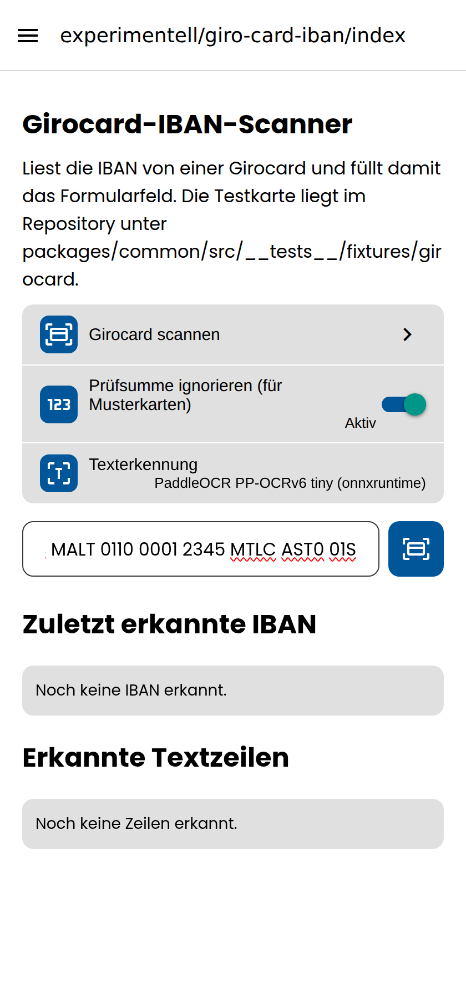
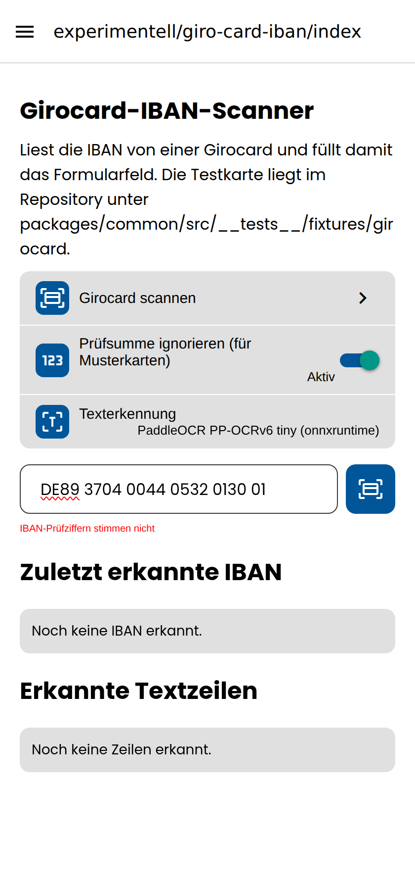

# Screenshots: das IBAN-Feld

Aufgenommen am **gebauten Web-Export** (`yarn workspace rocket-meals-dev export:web`,
statisch ausgeliefert) mit Playwright.

**Gezeigt ist der Screen Experimentell → Girocard-IBAN, nicht ein echtes
Formular.** Formulare liegen auf dem Server und sind einer anonymen Sitzung
nicht zugänglich (`form-submissions` meldet „Keine Daten gefunden"), hier steht
kein Konto zur Verfügung. Der Screen bettet aber dasselbe `IBANInput` ein, das
`form-submission` für ein `value_string-bank_account_number`-Feld rendert — es
ist dieselbe Komponente, dieselben Props, derselbe `onChange`-Weg ins
Formular. Dass der Screen sie für genau dieses Feld rendert, hält
`apps/frontend/app/__tests__/formIbanField.test.ts` fest.

## 01 — eine lange IBAN wird nicht mehr abgeschnitten

`MT84 MALT 0110 0001 2345 MTLC AST0 01S` — 31 Zeichen, mit der gedruckten
Gruppierung 38. Die Längenbegrenzung des Feldes stand auf 34, der Länge der
*Nummer*, und zählte die Leerzeichen mit: die letzte Gruppe fiel weg. Zwölf
Länder im Register sind lang genug dafür (BR, EG, JO, KW, LC, MT, MU, PS, QA,
RU, SC, UA). Die russische IBAN im selben Durchlauf hält jetzt alle 41 Zeichen.

Kein Fehler unter dem Feld: die Nummer ist vollständig und die Prüfziffern
stimmen.

## 02 — falsche Prüfziffern werden benannt

`DE89 3704 0044 0532 0130 01` — richtige Länge für Deutschland, eine Ziffer
geändert. Vorher sagte das Feld dazu nichts; die einzige Prüfung fragte, ob der
*angezeigte* String kürzer als 15 Zeichen ist, und das war er nicht. Jetzt
normalisiert das Feld zuerst und fragt `IbanRecognitionHelper.getIbanFieldProblem`.

Rechts daneben, auf beiden Bildern: der Kamera-Button, der den Girocard-Scanner
öffnet.
