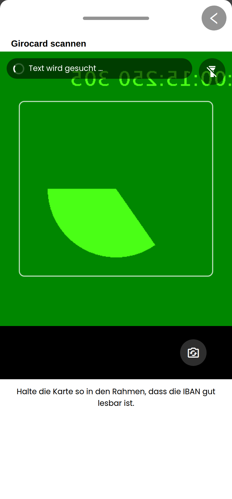
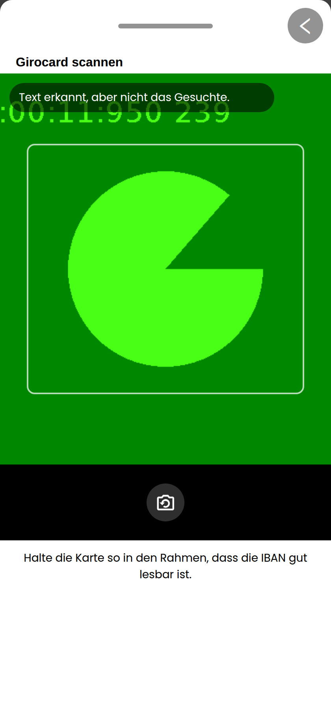
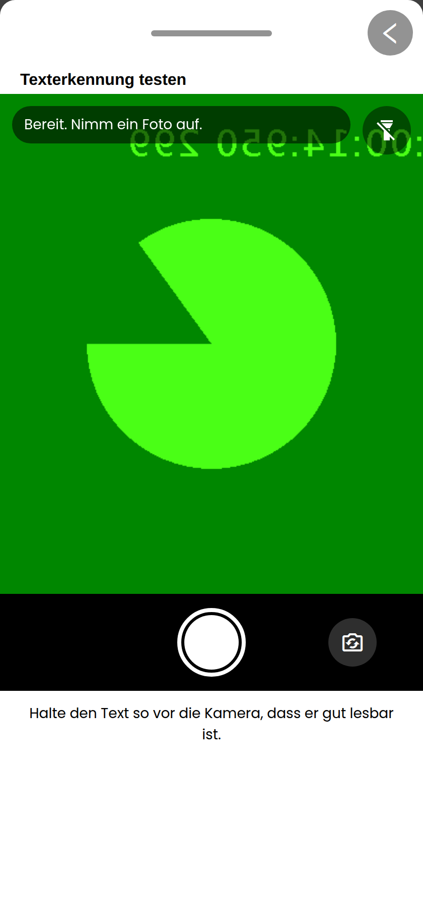
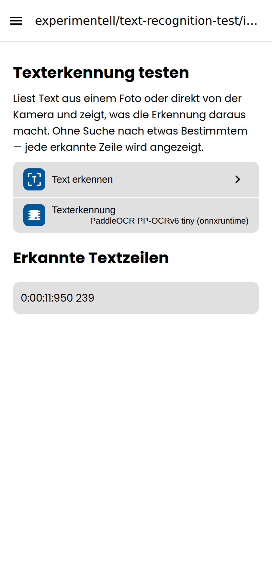

# Screenshots: Girocard-IBAN-Scanner und Texterkennung

Aufgenommen am **gebauten Web-Export** (`yarn workspace rocket-meals-dev export:web`,
statisch ausgeliefert) mit Playwright und Chromiums Fake-Kamera — daher das
grüne Testbild statt einer Karte.

Der Ablauf dazu steht in `SCREENSHOTS_PLAYWRIGHT.md`, die Sache selbst in
`docs/giro-card-iban-handover.md`.

## 01–06: der Stand mit Tesseract im WebView

Die ersten sechs stammen aus der Arbeit, die den Scanner gebaut hat. Sie zeigen
den Screen, die Quellenauswahl, das gefüllte Feld, den Auslöser ohne Fund, die
Unschärfemeldung und die Breite im Desktop-Browser.

## 07–10: das Kamera-Modal, wie es jetzt aussieht

### 07 — Girocard, automatischer Scan

Vorschau über die volle Modalbreite. Licht oben rechts im Bild, Kamerawechsel
unten rechts, beides runde Knöpfe ohne Beschriftung. **Kein Auslöser** — ein
automatischer Scan endet, wenn er etwas findet, nicht wenn ein Finger es sagt.
Der Rahmen sagt, wo die Karte hingehalten werden soll.

### 08 — Girocard, Auslöser gedrückt, keine IBAN darauf

Der Fehler, um den es ging. Die Engine hat `…00:11:950 239` gelesen — das steht
hinter dem Modal auch in „Erkannte Textzeilen" — und der Status sagt das jetzt:
**„Text erkannt, aber nicht das Gesuchte."** Vorher stand dort „Auf diesem Foto
war kein Text zu lesen", während der Text längst gelesen war.

Das Standbild ersetzt die Vorschau, der Auslöser weicht dem Knopf für ein neues
Foto, und das Licht ist weg: an einem Standbild gibt es nichts zu beleuchten.

### 09 — Texterkennung testen

Derselbe Aufbau **ohne Rahmen**. Dieser Screen sucht nichts Bestimmtes, also
gibt es auch keine Stelle, an der etwas zu halten wäre — ein Rahmen würde nur
behaupten, es gäbe eine.

### 10 — dieselbe Aufnahme, danach

**Beide** Modal-Ebenen sind zu. Vorher nahm das Schließen nur die Kamera
herunter und stellte die Quellenauswahl wieder hin. Die erkannte Zeile steht
auf dem Screen — ohne etwas zu suchen ist der Text selbst das Ergebnis, und die
erste nichtleere Lesung beendet den Scan.
